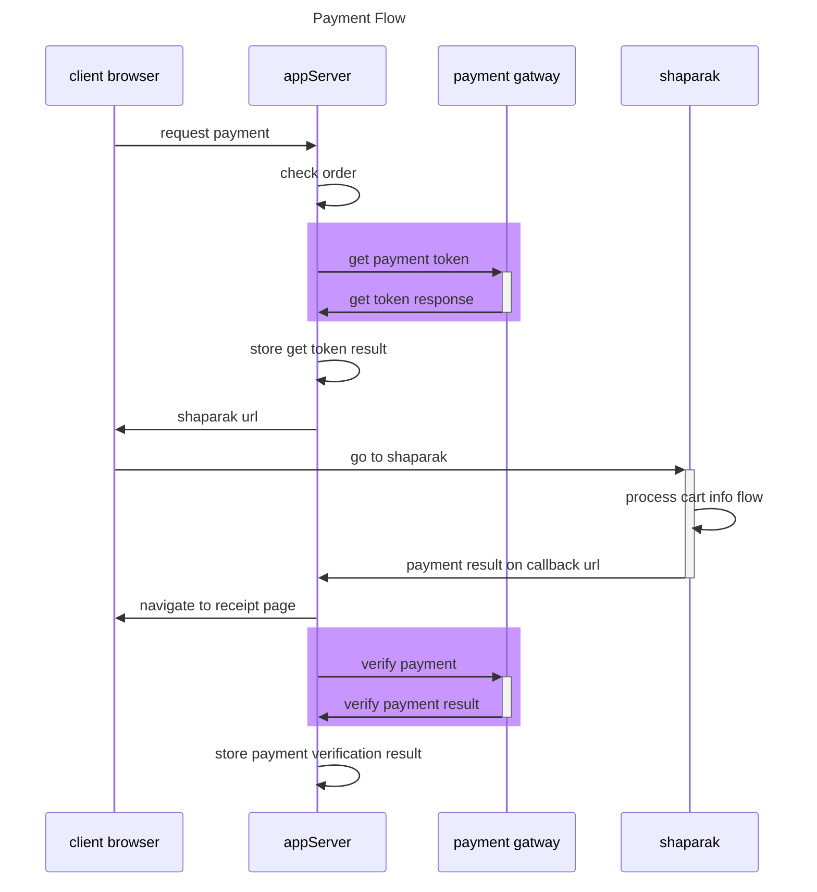

# پکیج اتصال به درگاه بانک سامان

این ریپوزیتوری امکان اتصال به درگاه بانک سامان را ایجاد میکند.
کدها با زبان جاواسکریپت پیاده سازی شده

---
**برای مطالعه ی جزئیات پیاده سازی صفحه ی ویکی را مشاهده کنید**

[https://github.com/mohsenxad/sep-payment-gateway/wiki](https://github.com/mohsenxad/sep-payment-gateway/wiki)

---

## نحوه ی نصب پکیج

```
npm i sep-payment-gatway -s
```

## نحوه ی استفاده از پیکج

### تعریف گیتوی سامان

```
require('dotenv').config();

const sepGateway = require('./src')(
    {
        SEP_TERMINAL_ID: process.env.SEP_TERMINAL_ID,
    }
);

console.log(sepGateway);
```

### نحوه ی دریافت توکن

```

const invoice = sepGateway.makeInvoice(
    {
        Amount:1000,
        RedirectURL:'https://<YOUR_SITE_HOST.IR>/<CALL_BACK_PAHT>',
        ResNum:`SEP_TEST_PAYMENT_${Math.floor(Math.random() * 999)}`,
    }
)

sepGateway.createPayment(invoice);

```

### نحوه ی تایید پرداخت

```
const refNumber = 'REFRENCE_NUMBER_OF_PAYMENT_FROM_SEP';

sepGateway.verifyPayment(refNumber);
```

### نحوه ی برگشت پرداخت

```
const refNumber = 'REFRENCE_NUMBER_OF_PAYMENT_FROM_SEP';
sepGateway.reversePayment(refNumber);
```


## payment flow


## imporovment

TerminalId in getToken as string
TerminalNumber in verfiy and reverse as number

status in get token is 1 or -1 as boolean

if a transaction reversed before: we get ResultCode as موفق but success as false
what does this means

## Entites

1. invoice


## digram creation

[mermaid](https://mermaid.js.org/syntax/sequenceDiagram.html)

## install jest
1. npm install --save-dev jest

## video process

1. review docuement
2. create models test
3. create modesl
4. create functions test
5. create functions