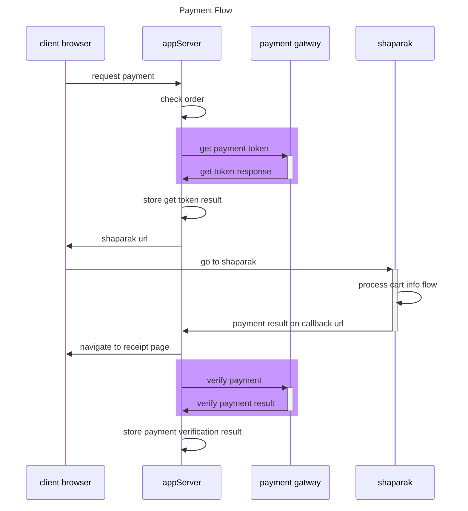

# پکیج اتصال به درگاه بانک سامان

این ریپوزیتوری امکان اتصال به درگاه بانک سامان را ایجاد میکند.
کدها با زبان جاواسکریپت پیاده سازی شده

---
**برای مطالعه ی جزئیات پیاده سازی صفحه ی ویکی را مشاهده کنید**

[https://github.com/mohsenxad/sep-payment-gateway/wiki](https://github.com/mohsenxad/sep-payment-gateway/wiki)

---

## نحوه ی نصب پکیج

```
npm i sep-payment-gatway -s
```

## نحوه ی استفاده از پیکج

### تعریف گیتوی سامان

```
require('dotenv').config();

const SEP_TERMINAL_ID = process.env.SEP_TERMINAL_ID;

const sepGateway = require('./src/use-cases')(
    {
        SEP_TERMINAL_ID: SEP_TERMINAL_ID,
    }
);

console.log(sepGateway);
```

### نحوه ی دریافت توکن

```
const getTokenRequest = sepGateway.makeGetTokenRequest(
    {
        Amount:5000,
        ResNum:"tR43",
        RedirectURL:"heeloo.com"
    }
);

const getTokenResponse = await sepGateway.getToken(
    {
        getTokenRequest: getTokenRequest
    }
);
```

### نحوه ی تایید پرداخت

```
const verifyTransactionRequest = sepGateway.makeVerifyTransactionRequest(
    {
        RefNum:"fake_RefNum"
    }
);

const verifyTransactionResponse = await sepGateway.verifyTransaction(
    {
        verifyTransactionRequest:verifyTransactionRequest
    }
);
```

### نحوه ی برگشت پرداخت

```
const reverseTransactionRequest = sepGateway.makeReverseTransactionRequest(
    {
        RefNum: "fake_RefNum"
    }
);

const reverseTransactionResponse = await sepGateway.reverseTransaction(
    {
        reverseTransactionRequest: reverseTransactionRequest
    }
);
```

## video process

1. review docuement
2. create models test
3. create modesl
4. create functions test
5. create functions

## payment flow



## digram creation

[mermaid](https://mermaid.js.org/syntax/sequenceDiagram.html)

## install jest
1. npm install --save-dev jest