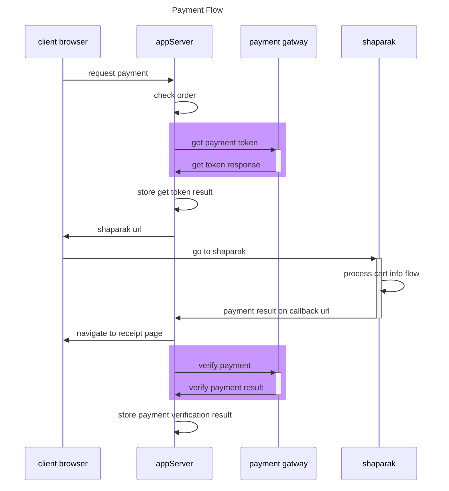

## video process

1. review docuement
2. create models test
3. create modesl
4. create functions test
5. create functions

## payment flow

## digram creation

[mermaid](https://mermaid.js.org/syntax/sequenceDiagram.html)

## install jest
1. npm install --save-dev jest