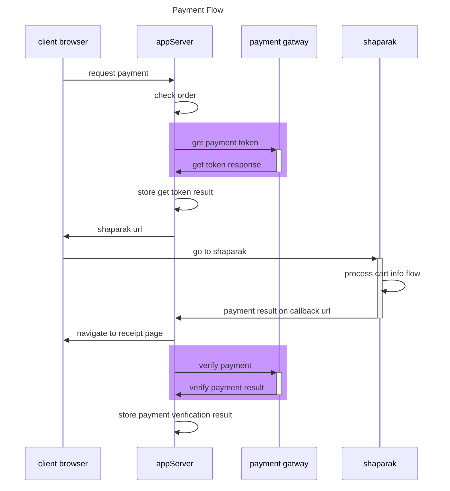

<h1 align="center" style="font-family:'tahoma';" >
🌐 پکیج اتصال به درگاه بانک سامان
</h1>

<div align="center" style="font-family:'tahoma';">
  <strong>
  این ریپوزیتوری امکان اتصال به درگاه بانک سامان را ایجاد میکند.
کدها با زبان جاواسکریپت پیاده سازی شده
  </strong>
</div>


---
**برای مطالعه ی جزئیات پیاده سازی صفحه ی ویکی را مشاهده کنید**

[https://github.com/mohsenxad/sep-payment-gateway/wiki](https://github.com/mohsenxad/sep-payment-gateway/wiki)

---

## 👨‍💻 نحوه ی نصب پکیج

```
npm i sep-payment-gatway -s
```

## 👨‍💻 نحوه ی استفاده از پیکج

### ⚙️ تعریف گیتوی سامان

<div align="left">

```
require('dotenv').config();

const sepGateway = require('./src')(
    {
        SEP_TERMINAL_ID: process.env.SEP_TERMINAL_ID,
    }
);

console.log(sepGateway);
```

</div>


### ⚙️ نحوه ی دریافت توکن

<div align="left">

```

const invoice = sepGateway.makeInvoice(
    {
        Amount:1000,
        RedirectURL:'https://<YOUR_SITE_HOST.IR>/<CALL_BACK_PATH>',
        ResNum:`SEP_TEST_PAYMENT_${Math.floor(Math.random() * 999)}`,
    }
)

const payment = await sepGateway.createPayment(invoice);
```

</div>


### ⚙️ دریافت محتوای پیج برای ارسال به کاربر

<div align="left">

```
payment.getPaymentRedirectHTMLPage();
```

</div>

### ⚙️ دریافت آدرس اینترنتی  برای ارسال به کاربر

<div align="left">

```
payment.getPaymentUrl();

```

</div>


### ⏳ انتظار برای پرداخت مشتری

<div align="right">

در این مرحله مشتری، وارد صفحه ی بانک میشود و مراحل پرداخت را تکمیل میکند. بعد از انجام و حتی  **عدم پرداخت** مشتری ، بانک مشتری را به آدرس  callBack مشخص شده توسط شما در مرحله ی قبل باز خواهند گرداند.

منتظر دریافت پاسخ از بانک باشید و اطلاعات ارسال شده توسط بانک را با دقت بررسی کنید. 

اطلاعات refNumber در این مرحله دریافت میشود. در مراحل بعدی این اطلاعات مورد نیاز میباشد.


**☠️ مدیریت و بررسی اطلاعات دریافت شده در آدرس کال بک از مهمترین و خطرناکترین مراحل پرداخت میباشد.
مراقب این مرحله باشید.**

**⚠️ آدرس callBack باید به یک Function با مشخصات [idempotent](https://dev.to/hzoltan/what-is-an-idempotent-function-2hkn) باشد.**

- 🏴‍☠️مراقب تکرار درخواست روی این آدرس باشید.
- 🏴‍☠️مراقب ارسال درخواست پشت سر هم در چند میلی ثانیه روی آدرس callBack باشید.
- 🏴‍☠️اطلاعات دریافت شده روی آدرس callBack را به صورت درجا در بانک اطلاعاتی ذخیره کنید.
- 🏴‍☠️وضعیت پرداخت را در لحظه به حالت در حال پردازش ، در بانک اطلاعاتی  تغییر دهید.


---

<div align="center">

**🏆 اگر متوجه خطرات این بخش نیستید با من مشورت کنید [mohsenXAD](https://t.me/MohsenXad)**


</div>

---


</div>


### ⚙️ نحوه ی تایید پرداخت

<div align="left">

```
const refNumber = 'REFRENCE_NUMBER_OF_PAYMENT_FROM_SEP';

sepGateway.verifyPayment(refNumber);
```

</div>


### ⚙️ نحوه ی برگشت پرداخت

<div align="left">

```
const refNumber = 'REFRENCE_NUMBER_OF_PAYMENT_FROM_SEP';
sepGateway.reversePayment(refNumber);
```

</div>

## 📐 payment flow


## 💎 imporovment for SEP Gateway

- 🤷‍♂️ Different data type for same value

    |Mehtod|Parameter|Data Type|
    |---|---|---|
    |getToken|`TerminalId`|**[String](https://developer.mozilla.org/en-US/docs/Web/JavaScript/Reference/Global_Objects/String)**|
    |verfiy|`TerminalNumber`|**[Number](https://developer.mozilla.org/en-US/docs/Web/JavaScript/Reference/Global_Objects/Number)**|
    |reverse|`TerminalNumber`|**[Number](https://developer.mozilla.org/en-US/docs/Web/JavaScript/Reference/Global_Objects/Number)**|


- 🤷‍♂️ status in get token is 1 or -1 but data type is number insted of boolean

- 🤷‍♂️ Missleading state:

    if a transaction reversed before: we get ResultCode as موفق but success as false
    what does this means

## 📦 Entites

1. invoice


## digram creation

[mermaid](https://mermaid.js.org/syntax/sequenceDiagram.html)

## install jest
1. npm install --save-dev jest

## video process

1. review docuement
2. create models test
3. create modesl
4. create functions test
5. create functions